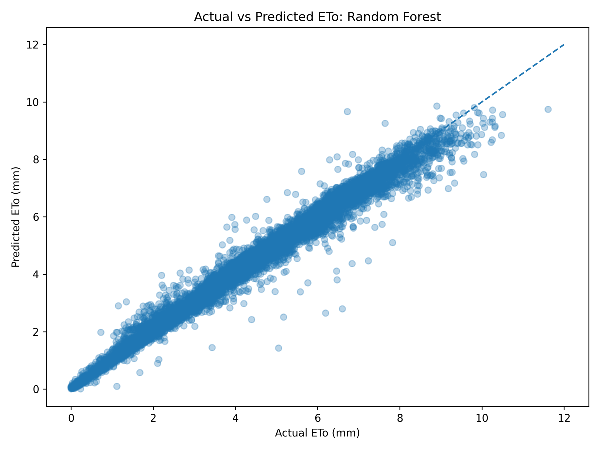

# CIMIS ETo Machine Learning

## Overview

This project develops and evaluates machine learning models for predicting daily reference evapotranspiration (ETo) using weather observations from the California Irrigation Management Information System (CIMIS). Beyond predictive performance, the project examines model behavior across seasonal conditions, ETo ranges, and geographically held-out conditions.

The project focuses on three questions:

1. How well can daily ETo be predicted from weather variables?
2. Does explicitly including seasonality improve predictions?
3. How well does the model generalize to geographic locations that were not included during training?

The project uses exploratory data analysis, data processing, regression modeling, model evaluation, and error analysis to investigate these questions.

## Technology & Tools

- **Language:** Python
- **Data Analysis:** pandas, NumPy
- **Machine Learning:** scikit-learn
- **Visualization:** Matplotlib
- **Development:** Jupyter Notebook
- **Environment:** Python virtual environment (`venv`)

## Results

### Random Forest Prediction Performance

In Experiment 1, the Random Forest model achieved an MAE of **0.138 mm**, RMSE of **0.219 mm**, and R² of **0.991** on the held-out test set.

The Random Forest model was also evaluated using a geographic hold-out strategy in Experiment 3 to test how well it generalizes to weather stations that were not included during training.

The figure below shows Random Forest predictions from the geographic holdout evaluation in Experiment 3.


### Key Findings

* Linear Regression substantially reduced prediction error compared with the mean baseline, reducing MAE from 1.955 mm to 0.258 mm.
* Random Forest further reduced MAE from 0.258 mm to 0.138 mm compared with Linear Regression.
* Weather variables alone provided very strong predictive performance.
* Prediction error generally increased at higher ETo values.
* The model generalized reasonably well to held-out weather stations, although performance varied by location.
* The model showed little overall systematic bias.

---

## Research Questions

### Experiment 1: Weather-Based ETo Prediction

**Question:** How well can ETo be predicted using weather variables?

Three models were compared:

1. **Mean Baseline:** Predicts the training-set mean for every test observation.
2. **Linear Regression:** Models ETo using a linear relationship between the weather variables and the target.
3. **Random Forest:** Uses an ensemble of decision trees to capture nonlinear relationships between the weather variables and ETo.

The dataset was divided into 80% training data and 20% testing data using a fixed random state of **42**.

The Random Forest model used **100 trees** and a fixed random state of **42**.

#### Results

| Model             |  MAE (mm) | RMSE (mm) |        R² |
| ----------------- | --------: | --------: | --------: |
| Mean Baseline     |     1.955 |     2.306 |    -0.001 |
| Linear Regression |     0.258 |     0.353 |     0.977 |
| Random Forest     | **0.138** | **0.219** | **0.991** |

Random Forest produced the lowest MAE and RMSE and the highest R² of the three approaches.

Compared with the mean baseline, Random Forest reduced MAE from **1.955 mm to 0.138 mm** and increased R² from approximately zero to **0.991**.

Linear Regression also performed substantially better than the baseline, but Random Forest achieved lower error and explained a greater proportion of the variation in ETo.

#### Error Analysis

The Random Forest model had the lowest MAE across every ETo range evaluated.

| ETo Range | Baseline MAE (mm) | Linear Regression MAE (mm) | Random Forest MAE (mm) |
| --------- | ----------------: | -------------------------: | ---------------------: |
| 0–2 mm    |             3.015 |                      0.288 |              **0.079** |
| 2–5 mm    |             0.942 |                      0.201 |              **0.131** |
| 5–8 mm    |             2.130 |                      0.247 |              **0.161** |
| >8 mm     |             4.455 |                      0.615 |              **0.256** |

The Random Forest model generally maintained low error across the range of ETo values, although errors increased for the highest-ETo observations.

---

### Experiment 2: Seasonal Information

**Questions:** Does explicitly including Day of Year improve ETo predictions?

Two Random Forest models were compared:

1. **Weather Only:** Uses the weather variables from Experiment 1.
2. **Weather + Day of Year:** Uses the same weather variables plus `Jul`, representing Day of Year.

Both models used the same 80/20 train-test split and Random Forest configuration as Experiment 1.

#### Results

| Model                 |  MAE (mm) | RMSE (mm) |    R² |
| --------------------- | --------: | --------: | ----: |
| Weather Only          |     0.138 |     0.219 | 0.991 |
| Weather + Day of Year | **0.137** | **0.215** | 0.991 |

Adding Day of Year produced only a small improvement:

* MAE improved by approximately **1%**
* RMSE improved by approximately **2%**
* R² remained **0.991**

This suggests that the weather variables already capture most of the seasonal information relevant to daily ETo prediction.

The small improvement from adding Day of Year suggests that explicitly providing a seasonal feature provides limited additional predictive value for this dataset and modeling approach.

#### Error Analysis

The two models produced very similar prediction behavior.

The Weather + Day of Year model produced slightly lower overall MAE and RMSE, although the difference was small.

The highest-ETo observations remained the most difficult to predict for both models. The >8 mm range had slightly higher MAE when Day of Year was included, suggesting that the additional seasonal feature did not consistently improve predictions across every ETo range.

---

### Experiment 3: Geographic Generalization

**Question:** How well does the model generalize to weather stations that were not included during training?

A Random Forest model was evaluated using station-level holdout validation.

For each station:

1. All observations from that station were excluded from training.
2. A Random Forest model was trained on the remaining stations.
3. The model predicted ETo for the held-out station.
4. MAE, RMSE, and R² were calculated.

The same Random Forest configuration used in Experiment 1 was used for each station.

#### Station-Level Results

| Held-Out Station    |  MAE (mm) | RMSE (mm) |        R² |
| ------------------- | --------: | --------: | --------: |
| FivePoints          |     0.204 |     0.316 |     0.985 |
| Davis               | **0.162** | **0.247** | **0.988** |
| Bishop              |     0.268 |     0.359 |     0.969 |
| Calipatria/Mulberry |     0.278 |     0.433 |     0.965 |
| San Luis Obispo     |     0.171 |     0.251 |     0.969 |

The model achieved an MAE between **0.162 and 0.278 mm** across the five held-out stations.

Davis produced the lowest MAE and highest R², while Calipatria/Mulberry produced the highest MAE and RMSE and the lowest R².

This variation suggests that geographic differences in weather patterns may affect model generalization.

Despite these differences, the model maintained strong performance across all five held-out stations, with R² values of at least 0.965 and MAE values between 0.162 and 0.278 mm.

---

## Dataset

The dataset contains five years of daily weather observations from five CIMIS weather stations representing different regions of California, covering September 1, 2021 through September 2, 2026.

### Weather Stations

* Bishop
* Calipatria/Mulberry
* Davis
* FivePoints
* San Luis Obispo

The dataset contains **9,051** observations after preprocessing.

---

## Target Variable

The prediction target is:

**ETo (mm)**

Reference evapotranspiration (ETo) is an estimate of the amount of water that would be transferred from a standardized reference surface to the atmosphere through evaporation and plant transpiration under the observed weather conditions.

ETo is calculated from meteorological observations rather than directly measured by a sensor. In this project, the CIMIS-calculated ETo values serve as the reference target that the machine learning models are trained to predict from weather variables.

---

## Weather Features

The models use the following weather variables:

* Precipitation
* Average solar radiation
* Average vapor pressure
* Maximum air temperature
* Minimum air temperature
* Average air temperature
* Maximum relative humidity
* Minimum relative humidity
* Average relative humidity
* Dew point
* Average wind speed

Station identifiers, station names, geographic region, and date were not included as direct weather predictors.

---

## Seasonal Features

The dataset includes:

* `Jul` - Day of Year

Day of Year was excluded from Experiment 1 and included as an additional feature in Experiment 2 to determine whether explicitly providing seasonal information improved model performance.

---

## Exploratory Data Analysis

The exploratory analysis examined:

* Target distribution
* Feature distributions
* Correlations between weather variables and ETo
* ETo differences between weather stations
* Seasonal ETo patterns
* Relationships between weather variables and ETo

### Key EDA Findings

Average solar radiation had the strongest linear relationship with ETo (r = 0.900), followed by maximum air temperature (r = 0.855) and average air temperature (r = 0.842).

Relative humidity variables showed negative relationships with ETo, while temperature and solar radiation showed positive relationships.

Station-level analysis also showed meaningful geographic difference in average ETo.

| Station             | Mean ETo (mm) |
| ------------------- | ------------: |
| Bishop              |         4.209 |
| Calipatria/Mulberry |     **5.401** |
| Davis               |         3.899 |
| FivePoints          |         4.336 |
| San Luis Obispo     |     **3.383** |

Calipatria/Mulberry had the highest mean ETo, while San Luis Obispo had the lowest.

ETo also showed a broad seasonal pattern, with values generally increasing through the first half of the year before decreasing later in the year.

The exploratory analysis is available in:

`notebooks/01_eda.ipynb`

---

## Data Preprocessing

The raw CIMIS dataset was processed using the following steps:

1. Load the raw CSV dataset.
2. Select the relevant weather, target, station, and seasonal columns.
3. Remove rows containing missing values.
4. Save the cleaned data set to `data/processed/CIMIS_daily_clean.csv`.

The preprocessing code is located in:

`src/preprocessing.py`

---

## Methodology

### Experiment 1

Experiment 1 compares three approaches:

* Mean baseline
* Linear Regression
* Random Forest

The dataset was divided into:

* 80% training data
* 20% testing data

A fixed random state of 42 was used to make the experiment reproducible.

---

### Experiment 2

Experiment 2 evaluates whether explicit seasonal information improves Random Forest predictions.

Two feature sets were compared:

**Weather Only**

```text
Weather variables
```

**Weather + Day of Year**

```text
Weather variables
+
Day of Year
```

Both models used the same train-test split and Random Forest configuration.

---

### Experiment 3

Experiment 3 evaluates geographic generalization using station-level holdout validation.

For each weather station:

1. All observations from that station are removed from the training data.
2. A Random Forest model is trained on the remaining stations.
3. The model predicts ETo for the held-out station.
4. MAE, RMSE, and R² are calculated for the held-out station.

This process is repeated for all five stations.

This evaluation is intended to determine whether the model can generalize beyond the geographic locations represented in its training data.

---

## Evaluation Metrics

The models are evaluated using three metrics.

### Mean Absolute Error (MAE)

Measures the average absolute difference between predicted and actual ETo.

Lower values indicate better performance.

### Root Mean Squared Error (RMSE)

Measures the square root of the average squared prediction error.

RMSE gives greater weight to larger errors.

Lower values indicate better performance.

### R²

Measures the proportion of variance in the target explained by the model.

Values closer to 1 indicate stronger predictive performance.

An R² near 0 indicates performance similar to mean-based prediction, while negative values indicate performance worse than that baseline.

---

## Error Analysis

Error analysis was performed to examine model behavior beyond aggregate metrics.

The analysis considers:

* Signed prediction error
* Absolute prediction error
* Error distributions
* Error versus actual ETo
* Error across different ETo ranges
* Geographic differences in prediction error

### Experiment 1 Error Analysis

The Random Forest model showed little overall systematic bias, with a mean signed error of approximately **-0.005 mm**.

The Linear Regression model also showed very little overall bias, with a mean signed error of approximately **0.001 mm**.

Both models showed higher average prediction error at higher ETo values, with the highest MAE occurring in the >8 mm range.

Random Forest maintained lower error than Linear Regression across all evaluated ETo ranges.

### Experiment 2 Error Analysis

The Weather Only and Weather + Day of Year models produced very similar error distributions.

Adding Day of Year slightly reduced overall error but did not substantially change the model's prediction behavior.

The highest ETo observations remained the most difficult to predict.

### Experiment 3 Error Analysis

Geographic holdout evaluation showed that prediction error varied by station.

The largest MAE occurred for Calipatria/Mulberry at **0.278 mm**, while Davis produced the lowest MAE at **0.162 mm**.

The variation in station-level performance indicates that geographic differences may influence model generalization.

---

## Reproducibility

The project is organized so that the preprocessing, training, evaluation, and error analysis workflow can be reproduced from the included raw dataset.

### Pipeline

```text
Raw CIMIS Dataset
        ↓
Preprocessing
        ↓
Cleaned Dataset
        ↓
Exploratory Data Analysis
        ↓
Model Training
        ↓
Predictions
        ↓
Evaluation
        ↓
Error Analysis
```

Random states are fixed where applicable to make model results reproducible.

---

## Running the Project

### 1. Cloning the repository

```bash
git clone https://github.com/SYee50/cimis-eto-ml.git
cd cimis-eto-ml
```

### 2. Create a virtual environment

```bash
python -m venv .venv
```

### 3. Activate the virtual environment

macOS/Linux:

```bash
source .venv/bin/activate
```

Windows:

```bash
.venv\Scripts\activate
```

### 4. Install dependencies

```bash
pip install -r requirements.txt
```

### 5. Run preprocessing

```bash
python src/preprocessing.py
```

### 6. Run the experiments

```bash
python src/train.py
```

### 7. Evaluate the models

```bash
python src/evaluate.py
```

The resulting metrics are saved under the corresponding experiment directories in `results/`.

---

## Project Structure

```text
cimis-eto-ml/
├── data/
│   ├── raw/
│   │   └── CIMIS_5station_5year_data_set.csv
│   └── processed/
│       └── CIMIS_daily_clean.csv
├── docs/
│   └── experiment_design.md
├── notebooks/
│   └── 01_eda.ipynb
├── results/
│   ├── experiment_1/
│   │   ├── metrics/
│   │   │   └── model_results.json
│   │   ├── plots/
│   │   │   ├── actual_vs_predicted_Linear_Regression.png
│   │   │   ├── error_distribution_Linear_Regression.png
│   │   │   ├── error_vs_actual_Linear_Regression.png
│   │   │   ├── actual_vs_predicted_Random_Forest.png
│   │   │   ├── error_distribution_Random_Forest.png
│   │   │   └── error_vs_actual_Random_Forest.png
│   │   └── error_analysis.md
│   ├── experiment_2/
│   │   ├── metrics/
│   │   │   └── model_results.json
│   │   ├── plots/
│   │   │   ├── actual_vs_predicted_Weather_Only.png
│   │   │   ├── error_distribution_Weather_Only.png
│   │   │   ├── error_vs_actual_Weather_Only.png
│   │   │   ├── actual_vs_predicted_Weather_plus_Day_of_Year.png
│   │   │   ├── error_distribution_Weather_plus_Day_of_Year.png
│   │   │   └── error_vs_actual_Weather_plus_Day_of_Year.png
│   │   └── error_analysis.md
│   └── experiment_3/
│       ├── metrics/
│       │   └── model_results.json
│       ├── plots/
│       │   └── actual_vs_predicted_Random_Forest.png
│       └── error_analysis.md
├── src/
│   ├── preprocessing.py
│   ├── train.py
│   ├── evaluate.py
│   └── error_analysis.py
├── .gitignore
├── requirements.txt
└── README.md
```

---

## Limitations

Several limitations should be considered when interpreting the results:

* The dataset contains observations from only five weather stations.
* The dataset covers five years of observations.
* Experiment 1 uses a random train-test split rather than a chronological split, so it does not directly evaluate performance on future, unseen time periods.
* The model does not explicitly incorporate geographic features such as latitude, longitude, or elevation, which could be investigated to improve spatial generalization.
* The highest ETo observations produce larger prediction errors.
* The analysis focuses on Random Forest and Linear Regression rather than a broader set of machine learning algorithms.
* The target ETo values are CIMIS-calculated estimates, so the model is learning to approximate a calculation based on meteorological inputs rather than predicting a directly measured quantity.

These limitations provide opportunities for future experiments.

---

## Future Work

Potential improvements include:

* Evaluate additional regression algorithms.
* Perform systematic hyperparameter tuning.
* Use time-aware train-test splits.
* Evaluate additional CIMIS weather stations.
* Add geographic features.
* Investigate high-ETo prediction errors.
* Compare performance across climate regions.
* Explore nonlinear seasonal representations.
* Develop automated model validation and reporting.

---

## Documentation

Additional project documentation is available in:

* `docs/experiment_design.md`
* `notebooks/01_eda.ipynb`
* `results/experiment_1/error_analysis.md`
* `results/experiment_2/error_analysis.md`
* `results/experiment_3/error_analysis.md`

---

## Data Source

The dataset was obtained from the **California Irrigation Management Information System (CIMIS)**.

The raw dataset used for this project is included in `data/raw` for reproducibility.

### Dataset Configuration

The dataset was generated through the official [CIMIS Station Reports](https://cimis.water.ca.gov/data/station-reports) page using the following configuration:

**Weather stations:**

| Station Name        | Station ID |
|---------------------|-----------:|
| FivePoints          |          2 |
| Davis               |          6 |
| Bishop              |         35 |
| Calipatria/Mulberry |         41 |
| San Luis Obispo     |         52 |

**Date range:** `09/01/2021` to `09/02/2026`

**Data fields:**

* Date
* Station Number
* Station Name
* CIMIS Region
* Day of Year (`Jul`)
* ETo (mm)
* Precipitation (mm)
* Average Solar Radiation (W/m²)
* Average Vapor Pressure (kPa)
* Maximum Air Temperature (°C)
* Minimum Air Temperature (°C)
* Average Air Temperature (°C)
* Maximum Relative Humidity (%)
* Minimum Relative Humidity (%)
* Average Relative Humidity (%)
* Dew Point (°C)
* Average Wind Speed (m/s)

The generated raw dataset contains 9,141 observations across the five selected weather stations. After removing rows containing missing values during preprocessing, 9,051 observations remain for analysis and modeling.

The exact generated dataset is included in `data/raw/CIMIS_5station_5year_data_set.csv`. The preprocessing steps used to create the cleaned dataset are documented in `src/preprocessing.py`.

---

## Project Goal

The goal of this project is not simply to maximize prediction accuracy, but to evaluate how reliably a machine learning model predicts ETo under different conditions.

The experiments therefore examine:

* Predictive performance
* Seasonal effects
* Geographic generalization
* Error behavior
* Model limitations

This provides a more comprehensive evaluation of model performance than relying on a single performance metric.
